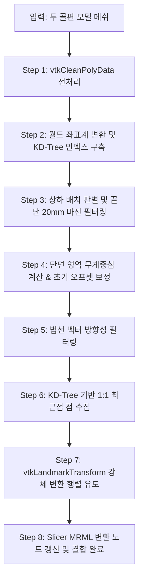

# 07. 골절면 스냅 로직 (Fracture Surface Snap)

이 문서는 대퇴골 골절 계획 모듈(`FemurFracturePlanner`)의 핵심 기능인 **골절면 스냅(Fracture Surface Snap)** 알고리즘의 동작 방식과 핵심 수학적/물리적 처리 흐름을 자세히 기술합니다.

---

## 1. 개요 및 목적
두 뼈 조각(골편 1, 골편 2)을 맞추는 정합 과정에서 일반적인 ICP(Iterative Closest Point)를 전체 뼈에 적용하면, 골절된 단면뿐만 아니라 뼈의 외벽(Cortex) 표면이 서로 엉겨 붙어 뼈가 내부로 파고들거나 뒤틀리는 오정합이 발생합니다.

**골절면 스냅** 기능은 오직 **서로 부러져 마주 보고 있는 횡단면(Fracture Surface)만 추출**하여 면 대 면으로 정교하게 척 들러붙도록 자동 정합하는 고정밀 기능입니다.

---

## 2. 알고리즘 전체 파이프라인 (Pipeline)

골절면 스냅 기능(`runFractureSurfaceSnap`)은 아래의 8단계 과정을 관통하며 동작합니다:

---

## 3. 단계별 상세 동작 설명

### Step 1: 메쉬 고립 정점 제거 전처리 (`vtkCleanPolyData`)
- **이유**: 골편 분리 필터(`vtkConnectivityFilter`)는 표면의 삼각형 면(Cells)들만 분리하며, 겉보기에는 보이지 않는 찌꺼기 고립 꼭짓점(Isolated Points)들을 포인트 배열에 그대로 남겨둡니다. 이 고립 정점들 때문에 뼈 조각의 실제 바운딩 박스(Bounds)가 뼈 전체 영역으로 뻥튀기되어 Z좌표가 심하게 왜곡됩니다.
- **처리**: `vtkCleanPolyData`를 통과시켜 유효한 면에 연결되지 않은 쓰레기 정점들을 물리적으로 완전히 지우고, Bounds와 무게중심(Center)이 실제 분리된 뼈 조각 크기로 정확하게 계산되도록 만듭니다.

### Step 2: 월드 좌표 변환 및 KD-Tree 구축
- 뼈가 가상 정복 화면에서 이동/회전된 현재의 월드 행렬(\(W_1, W_2\))을 획득합니다.
- 각 골편의 로컬 메쉬 데이터에 월드 행렬을 적용하여 실제 3D 화면 상의 월드 좌표 정점으로 변환합니다(`poly1World`, `poly2World`).
- 2번 골편 점군에 대해 "어떤 점과 가장 가까운 점이 무엇인가"를 빠르게 추적하기 위해 공간 탐색 트라인 `vtkKdTreePointLocator`를 빌드합니다.

### Step 3: 골편 상하 배치 판별 및 끝단 마진(20mm) 공간 필터링
- **원리**: 뼈가 비스듬하게 누워 있더라도, 실질적으로 맞닿을 부러진 단면 부위는 **두 골편이 서로 마주 보고 있는 상하 경계 끝단(약 20mm 마진)**에 몰려 있습니다.
- **판별**: 두 골편의 무게중심 Z좌표를 비교하여 어떤 뼈가 위에 있고 아래에 있는지 확인합니다 (`isFrag1Below`).
- **필터**: 
  - 1번 뼈가 아래에 있으면: 1번 뼈의 최상단으로부터 아래로 20mm 영역만 정합 대상으로 샘플링합니다.
  - 2번 뼈가 위에 있으면: 2번 뼈의 최하단으로부터 위로 20mm 영역만 대상으로 잡습니다.
  - 이 마진 필터링을 통해 뼈의 대다수를 차지하는 횡외벽(Cortex) 표면 점들을 1차적으로 완벽히 거릅니다.

### Step 4: 단면 무게중심 기준 초기 오프셋 보정 (Pre-alignment) `★핵심 개선`
- **문제점**: 시작할 때 두 뼈가 수평(X-Y) 방향으로 많이 어긋나(예: 15~20mm 이상) 있다면, 최근접 점을 찾을 때 맞은편 단면이 아닌 옆구리 벽면의 점들이 매칭되거나 한쪽 모서리로만 매칭이 쏠리는 병목이 생겨 수평 정렬이 어긋난 채 겹쳐버리는 문제가 있었습니다.
- **해결책**:
  1. 1번 단면 영역(Step 3의 마진과 Z축 방향 법선을 통과한 정점들)의 무게중심 \(C_{snap1}\)을 구합니다.
  2. 2번 단면 영역의 무게중심 \(C_{snap2}\)를 구합니다.
  3. 두 단면의 차이 벡터인 초기 보정 오프셋 \(T = C_{snap2} - C_{snap1}\)을 계산합니다.
  4. KD-Tree 공간 인덱스에서 대응점을 검색할 때, 1번 뼈의 정점 \(Pt_1\)을 가상으로 \(T\)만큼 이동시킨 임시 점 \(Pt_{1,temp} = Pt_1 + T\)로 검색을 수행합니다.
  5. 이를 통해 두 뼈가 원래 멀리 떨어져 있더라도, 가상으로 포개어진 중심 기준에서 KD-Tree가 동작하므로 **정확하게 마주보는 대칭점 \(Pt_2\)**를 매칭시킬 수 있습니다.

### Step 5: 법선 벡터(Normal) 내적 필터링
- 골절면 표면은 뼈의 외벽 표면과 달리, 법선 벡터가 뼈의 장축 방향(Z축)을 주로 향합니다.
- 따라서 정합용 포인트들의 법선 벡터 Z축 성분 크기가 일정 기준 이상(\(|n[2]| \ge 0.4\))인 것만 선별하여 옆구리 유입을 차단합니다.
- 또한, 두 뼈의 단면이 서로를 마주 보아야 하므로, 매칭된 두 점의 법선 벡터 내적(Dot Product)을 구해 **서로 정반대로 마주치는 성향**(\(n_1 \cdot n_2 \le -0.6\))을 만족하는 확실한 단면 점 쌍들만 엄격히 랜드마크로 등록합니다.

### Step 6: 1:1 최근접 대칭점 수집 및 오차 거리 평가
- Step 4의 오프셋 보정을 상쇄한 가상의 단면 간 유클리드 거리를 계산하여 임계 거리(\(SNAP\_DISTANCE\_LIMIT = 25.0mm\)) 이내에 도달하는 유효한 랜드마크 점 쌍들을 추출하여 `sourcePoints`와 `targetPoints` 배열에 수립합니다.
- 매칭 쌍의 개수가 최소 자유도 기준(\(SNAP\_MIN\_POINTS = 3\))보다 부족할 경우 예외 처리를 통해 재배치를 안내합니다.

### Step 7: vtkLandmarkTransform 최소제곱 강체 정합
- **이유**: 1:1로 정확하게 랜드마크가 정제 수립된 점군들에 일반적인 ICP(반복 정합)를 구동하면, 평균 오차가 극히 낮아져 반복 0회로 조기 수렴을 멈춰버리는(ICP Convergence Bug) 현상이 일어납니다.
- **해결책**: 원샷 최소제곱법 기반 강체 정합 알고리즘인 `vtkLandmarkTransform`을 기동하여, 수집된 랜드마크 쌍들을 한 번에 완벽하게 일치시키는 최적의 강체 변환 행렬(`snapMatrix`)을 도출합니다. 이 행렬에는 초기 오프셋 보정 성분과 정밀 회전/평행이동 성분이 모두 녹아들어 있습니다.

### Step 8: Slicer MRML 변환 노드 갱신
- 획득된 `snapMatrix`를 사용하여 1번 뼈의 새로운 월드 행렬을 구합니다:
  $$\mathbf{W}_{1,new} = \mathbf{SnapMatrix} \times \mathbf{W}_1$$
- 상위 transform 계층이 존재할 경우 로컬 좌표 행렬로 안전하게 캐스팅하여 변환 노드(`tNode1`)의 Matrix를 갱신합니다.
- 화면의 3D 뼈 모델이 수평/수직/회전이 동기화되며 골절면에 딱 맞물려 정복됩니다.
